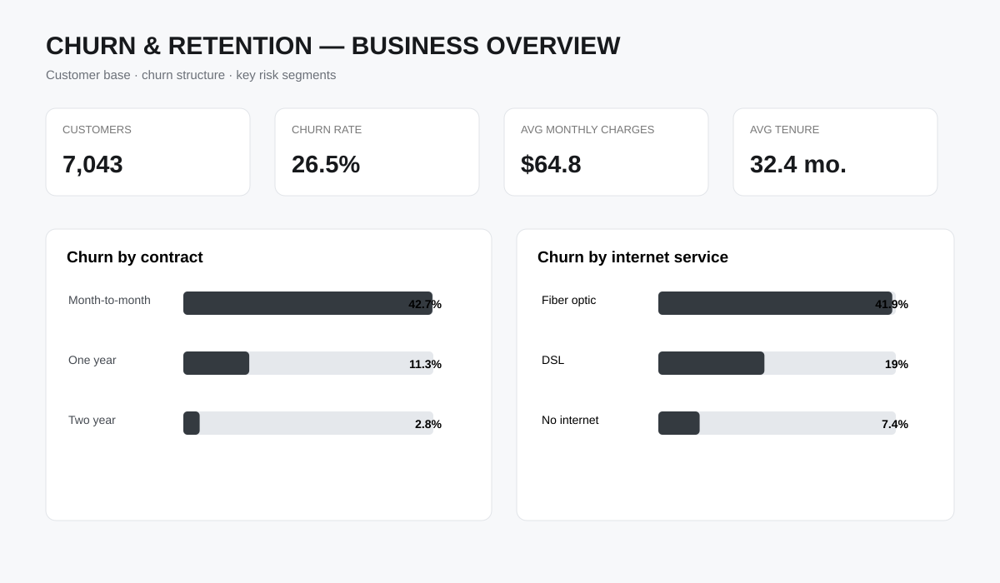
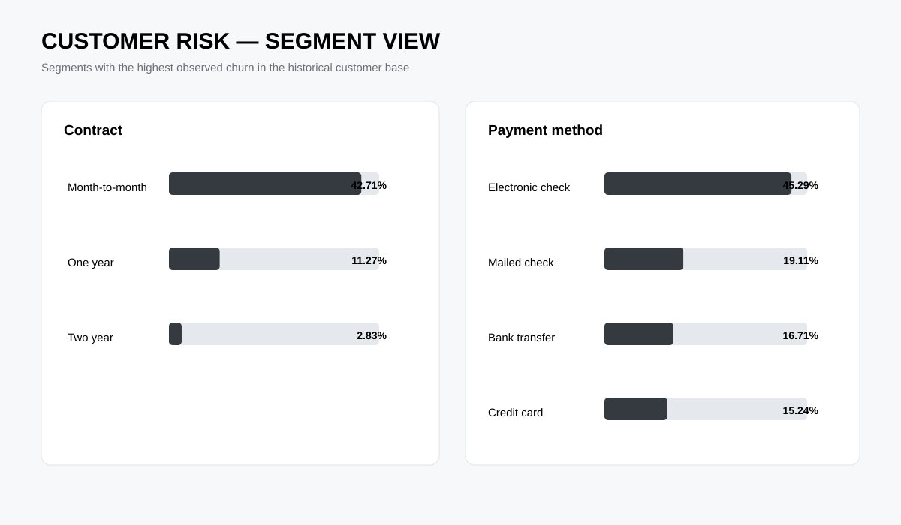
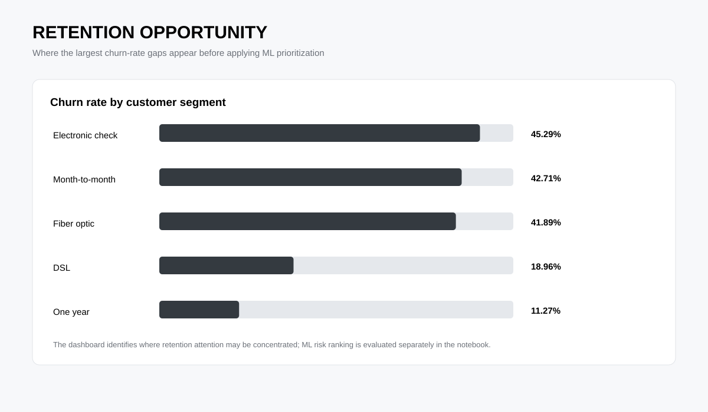

# Churn & Retention — ML

## О проекте

Это проект по прогнозированию оттока клиентов (**customer churn**) с упором не на формальное «угадать, уйдёт клиент или нет», а на более практическую задачу:

> **Каких клиентов имеет смысл считать наиболее рискованными и кого retention-команде стоит приоритизировать в первую очередь?**

Модель рассчитывает вероятность оттока для каждого клиента, после чего эти вероятности используются для построения **risk ranking** — списка клиентов от наиболее до наименее рискованных.

Поэтому здесь важна не только классификация, но и связь между ML-моделью и реальным бизнес-сценарием удержания клиентов.

---

## Бизнес-задача

Представим, что у компании есть ограниченный ресурс на удержание клиентов: например, менеджеры могут связаться только с частью клиентской базы.

Просто разделить всех клиентов на churn / no churn недостаточно.

Нам важнее понять:

- насколько хорошо модель ранжирует клиентов по риску;
- сколько реальных уходов находится среди top-risk клиентов;
- сколько клиентов придётся обработать, чтобы поймать значительную долю будущего churn;
- какой threshold выбрать при ограниченной ёмкости retention-команды.

**Главная идея проекта:** модель должна помогать принимать решение о том, **кого обрабатывать первым**, а не просто выдавать красивый accuracy.

---

## Датасет

Используется публичный датасет **IBM Telco Customer Churn**.

В нём есть информация о:

- клиентах;
- подключённых услугах;
- типе контракта;
- способе оплаты;
- ежемесячных и общих расходах;
- сроке обслуживания;
- демографических характеристиках;
- факте оттока.

Целевая переменная:

- `Churn = Yes` — клиент ушёл;
- `Churn = No` — клиент остался.

Исходный CSV намеренно **не хранится в репозитории**.

После скачивания его нужно положить сюда:

`data/WA_Fn-UseC_-Telco-Customer-Churn.csv`

Подробнее о структуре данных — в [data/README.md](data/README.md).

---

## Что делаем с данными

Перед моделированием:

1. проверяем структуру и обязательные столбцы;
2. проверяем дубликаты и пропуски;
3. переводим `TotalCharges` в числовой формат;
4. кодируем целевую переменную `Churn`;
5. исключаем `customerID`, потому что это идентификатор;
6. делим данные на train/test со **stratification**;
7. preprocessing выполняется внутри `sklearn Pipeline`.

Последний пункт особенно важен: параметры преобразований обучаются только на train, поэтому информация из test не попадает в preprocessing.

---

## Модели

### 1. Logistic Regression

Используется как интерпретируемый baseline.

Она нужна не только для сравнения качества. Логистическая регрессия даёт понятную отправную точку и позволяет анализировать направление влияния признаков через коэффициенты.

### 2. Random Forest

Используется как нелинейная модель для сравнения с baseline.

Она может учитывать нелинейные зависимости и взаимодействия признаков, которые линейная модель может не уловить.

Я не ставила целью подобрать «самую сложную модель». Задача проще: проверить, даёт ли более сложная модель заметное улучшение именно в полезном для бизнеса ранжировании.

---

## Как оцениваем модель

Основные метрики:

- **ROC-AUC** — насколько хорошо модель разделяет churn и non-churn по всему диапазону threshold;
- **PR-AUC** — особенно важна при дисбалансе классов;
- **Precision** — какая доля клиентов, которых мы считаем рискованными, действительно ушла;
- **Recall** — какую долю ушедших клиентов модель смогла найти;
- **F1** — баланс precision и recall;
- **Brier score** — насколько хорошо прогнозируемые вероятности соответствуют реальной частоте события;
- **confusion matrix** — для понимания ошибок при выбранном threshold.

Accuracy здесь не является основной метрикой: модель может получить неплохую accuracy, почти всегда выбирая класс «клиент не уйдёт», и при этом плохо находить churn.

---

## Почему PR-AUC важнее одной accuracy

Churn — меньший класс.

Поэтому нас интересует не только общее количество правильных предсказаний, а то, насколько хорошо модель находит именно клиентов с риском ухода.

Например, retention-команде гораздо полезнее модель, которая хорошо находит потенциальный churn, даже если при этом она ошибочно помечает часть лояльных клиентов, чем модель с высокой accuracy, которая почти всех считает безопасными.

---

## Threshold — это бизнес-решение

Я не считаю `0.5` каким-то магическим правильным threshold.

Например:

- threshold `0.30` → отмечаем больше клиентов и ловим больше потенциального churn;
- threshold `0.60` → список меньше, но precision обычно выше;
- threshold `0.80` → работаем только с небольшой группой наиболее рискованных клиентов.

Поэтому в проекте строится таблица threshold analysis:

- сколько клиентов попадёт в retention-сегмент;
- какая будет precision;
- какой recall;
- сколько churn-клиентов поймаем;
- какую долю всех churn-клиентов покрываем.

Это позволяет выбрать operating point исходя из реальной ёмкости retention-команды.

---

## Risk ranking

Отдельно клиенты сортируются по предсказанной вероятности churn.

После этого проверяется, какая доля реальных churn-клиентов находится среди:

- top 5%;
- top 10%;
- top 20%;
- top 30%;
- top 50%.

Для бизнеса это часто полезнее обычного бинарного предсказания.

Если retention-команда может обработать только 10% базы, главный вопрос будет не «какой у модели F1?», а:

> **какую долю будущего churn мы сможем покрыть, работая только с top 10% по риску?**

---

## Интерпретация признаков

Для модели рассчитывается **permutation feature importance** на отложенной test-выборке.

Используется PR-AUC как scoring metric.

Это позволяет увидеть, какие исходные клиентские признаки сильнее всего связаны с качеством churn ranking.

Важно: feature importance показывает связь признака с прогнозом модели, а **не доказывает причинность**.

---

## Проверка качества вероятностей

Для retention-сценария важно не только правильно расположить клиентов по риску.

Если модель говорит:

> вероятность churn = 0.80

хочется, чтобы такая вероятность была хотя бы примерно сопоставима с реальной частотой churn в подобных группах.

Поэтому дополнительно считается **Brier score** и анализируется калибровка вероятностей.

Это особенно полезно, если prediction используется дальше для приоритизации кампаний или расчёта ожидаемого эффекта.

---

## Контроль leakage

`customerID` исключён из модели, поскольку это идентификатор.

Все imputation, scaling и one-hot encoding находятся внутри `sklearn Pipeline`.

Таким образом, preprocessing обучается только на train.

Test используется только для финальной оценки.

Это позволяет избежать ситуации, когда информация из test случайно влияет на обучение модели.

---

## Структура проекта

```text
churn-retention-ml/
├── data/
│   └── README.md
├── notebooks/
│   └── churn_analysis.ipynb
├── sql/
│   └── customer_features.sql
├── src/
│   └── churn_model.py
├── reports/
│   └── methodology.md
├── powerbi/
│   ├── README.md
│   ├── measures.md
│   └── prepare_powerbi.py
├── requirements.txt
└── README.md
```

### Что где находится

- `notebooks/churn_analysis.ipynb` — основной аналитический разбор;
- `src/churn_model.py` — воспроизводимый ML pipeline;
- `sql/customer_features.sql` — подготовка customer-level признаков через SQL;
- `reports/methodology.md` — описание методологии и ограничений;
- `powerbi/README.md` — структура бизнес-дашборда и сценарий его использования;
- `powerbi/measures.md` — основные DAX measures;
- `powerbi/prepare_powerbi.py` — подготовка customer-level данных с ML risk score;
- `data/README.md` — инструкция по подготовке исходного датасета.

---

## SQL-часть

SQL используется не ради демонстрации синтаксиса.

В `customer_features.sql` формируется customer-level набор признаков из исходных данных.

В частности, рассчитываются:

- `avg_monthly_spend`;
- сегменты по tenure;
- характеристики контракта;
- услуги;
- способ оплаты;
- billing-параметры;
- целевая переменная churn.

Для SQL используется DuckDB.

---

## Ограничения проекта

### 1. Это predictive model, а не causal model

Высокая вероятность churn не означает, что клиент обязательно уйдёт.

И тем более она не означает, что звонок менеджера или скидка его удержит.

Чтобы ответить на второй вопрос, нужен отдельный retention experiment с control group.

### 2. Датасет исторический

Модель обучается на исторических данных и может хуже работать при изменении поведения клиентов, тарифов или продукта.

### 3. Threshold зависит от бизнеса

Оптимальный threshold нельзя выбрать только по математической метрике.

Он зависит от:

- количества клиентов, которых команда реально может обработать;
- стоимости контакта;
- стоимости retention-оффера;
- стоимости потерянного клиента.

---

## Следующий бизнес-шаг

В реальном продукте я бы не останавливалась на вопросе:

> «Кто уйдёт?»

Следующий этап:

1. построить churn score;
2. выбрать ограниченный retention-сегмент;
3. сформировать разные intervention strategies;
4. разделить клиентов на treatment/control;
5. измерить фактическое снижение churn;
6. сравнить эффект с затратами на удержание.

То есть ML-модель отвечает на вопрос **«кого приоритизировать?»**, а эксперимент — на вопрос **«помогает ли наше действие удержать клиента?»**.

---

## Стек

Python · pandas · NumPy · scikit-learn · SciPy · Matplotlib · seaborn · SQL · DuckDB · Power BI · DAX · Jupyter

---

## Power BI — бизнес-слой

ML-часть отвечает за оценку риска, а BI-слой показывает, где этот риск концентрируется и какие сегменты требуют внимания.

### Dashboard preview







Ключевые показатели визуальной части собраны в `powerbi/dashboard_summary.csv`. Исходный customer-level датасет также находится в репозитории.

## Статус

Текущая версия проекта включает:

- проверку качества данных;
- leakage-safe preprocessing;
- Logistic Regression как baseline;
- Random Forest как нелинейный benchmark;
- ROC-AUC и PR-AUC;
- precision / recall / F1;
- threshold analysis;
- risk ranking;
- top-risk customer coverage;
- permutation feature importance;
- проверку калибровки вероятностей;
- customer-level risk scoring для BI;
- структуру Power BI dashboard;
- бизнес-интерпретацию результатов.

Результаты анализа, модель и бизнес-визуализация представлены в ноутбуке и разделе `powerbi/`.
